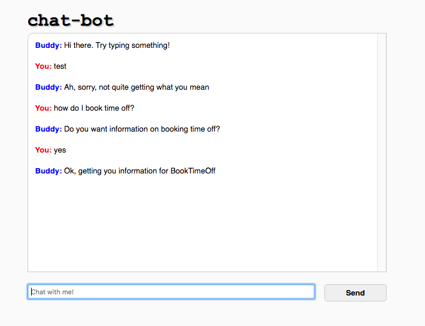

# chat-bot javascript client with integration to Amazon Lex chatbot service

This is a fork of the excellent [chat-bot](https://github.com/liouh/chat-bot) javascript chat client, which adds an example of integration with the [Amazon Lex](https://aws.amazon.com/lex/) chat service, without the need for a messaging platform like Facebook Message or Slack.

You could for example embed something like this into a website, to get quick integration with Lex.

Flow is as follows:

1. User enters something in the local javascript bot window
2. Text is sent to AWS Lex using javascript SDK
3. Callback function updated with response
4. Bot client updates with response
5. User can continue to interact
6. When Lex Fullfills, it is printed out in client to show we got there!

In production, you'd need to add code to do things based on the result in step 6, such as provide the FAQ answer, book a flight, etc.

## Configuration

1. Create a Lex chatbot on Amazon, build and publish
2. Create an IAM user group and give it AmazonLexRunBotsOnly policy
3. Create a user, add to this group, and make note of the **Access Key ID** and **Secret Ket ID**
4. Edit js/chat-bot.js and at the top of the script, set **accessKeyId** and **secretAccessKey** accordingly
5. Open index.html in a broswer
6. Start chatting

**WARNING!!!**

This is only a demo script to illustrate Lex integration. You obviously wouldn't want to hardcode your secret key ID in scripts. Please see AWS documentation for alternatives.

## Library Dependencies

* jQuery
* AWS Javascript SDK 2.58.0 or greater
